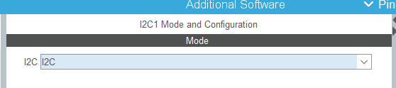
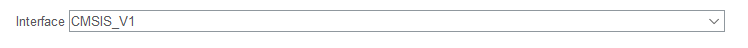
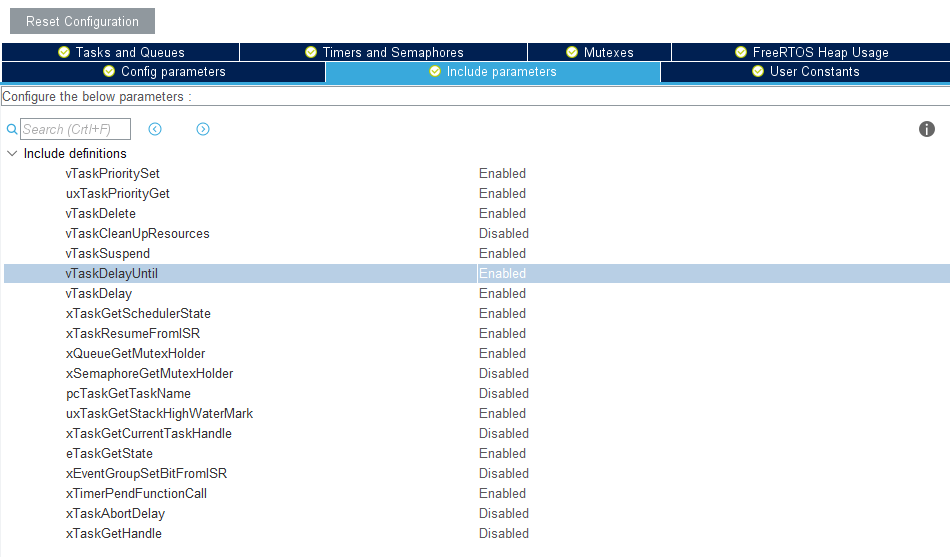
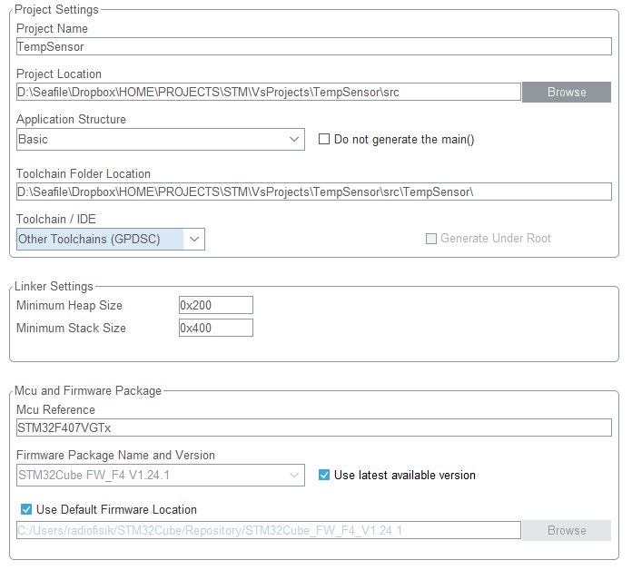
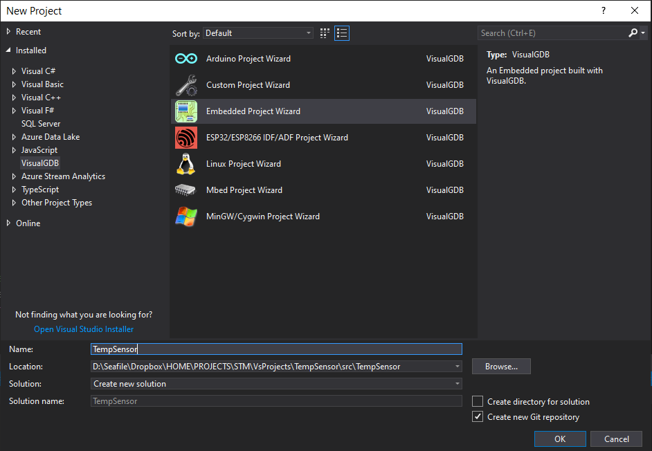
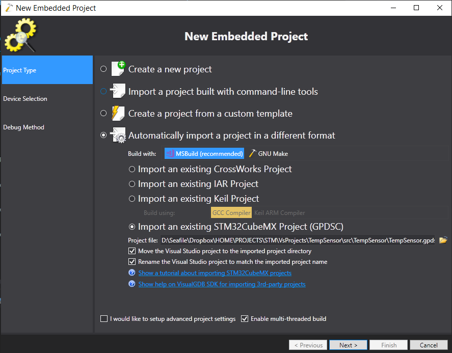
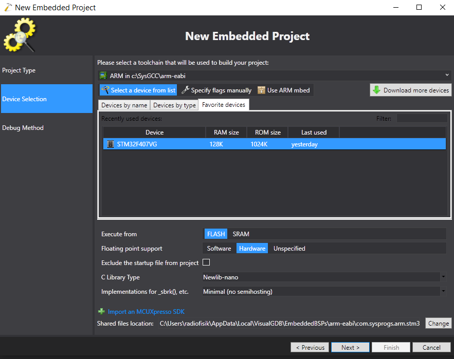
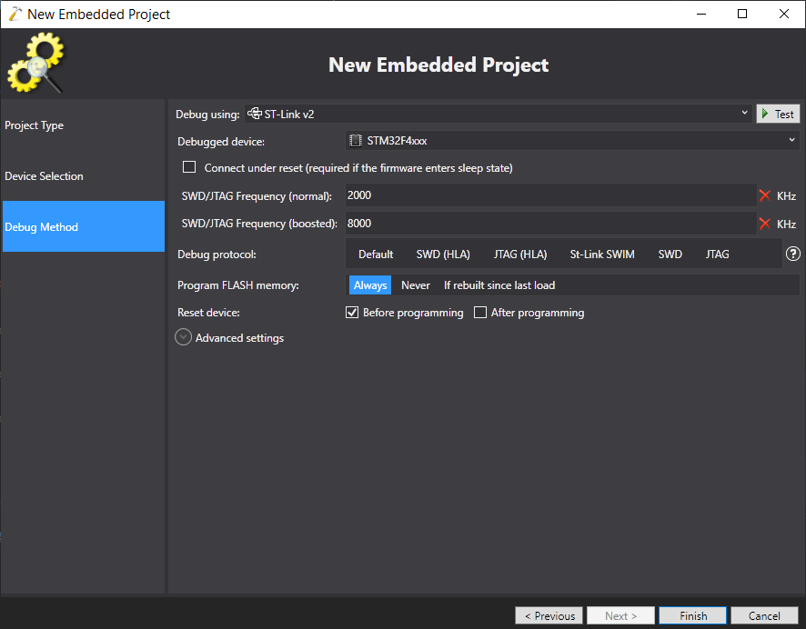

Для начала работы необходимо:

- установить Visual Studio 2017 c поддержкой С++ ( необходим VC++ 2017 toolset см https://visualgdb.com/support/getvcpp/).
- установить VisualGDB (https://visualgdb.com/)
- установить СubeMx (https://www.st.com/en/development-tools/stm32cubemx.html)

Создадим проект в CubeMx на основании модели контроллера STM32F407VG. В данном случае и платы STM32F4DISCOVERY.

Для подключения дисплея будем использовать I2C1. Включим его 

В экране используется микросхема PCF8574  которая поддерживает только 100kGz режим

Настроим DMA

В настойках GPIO видно к каким портам цеплять экран

Включим прерывания

Для подключения экрана будем использовать библиотеку http://blog.bulki.me/STM32-LCD-HD44780-I2C/ https://github.com/firebull/STM32-LCD-HD44780-I2C которая использует функцию vTaskDelayUntil() из FreeRTOS. Включим ее.

Настраиваем выгрузку

и жмем generate. Далее запускаем Visual Studio 2017. создаем проект в той же папке

Импортируем проект

Выбираем контроллер

выбираем отладчик, предварительно подключив его

